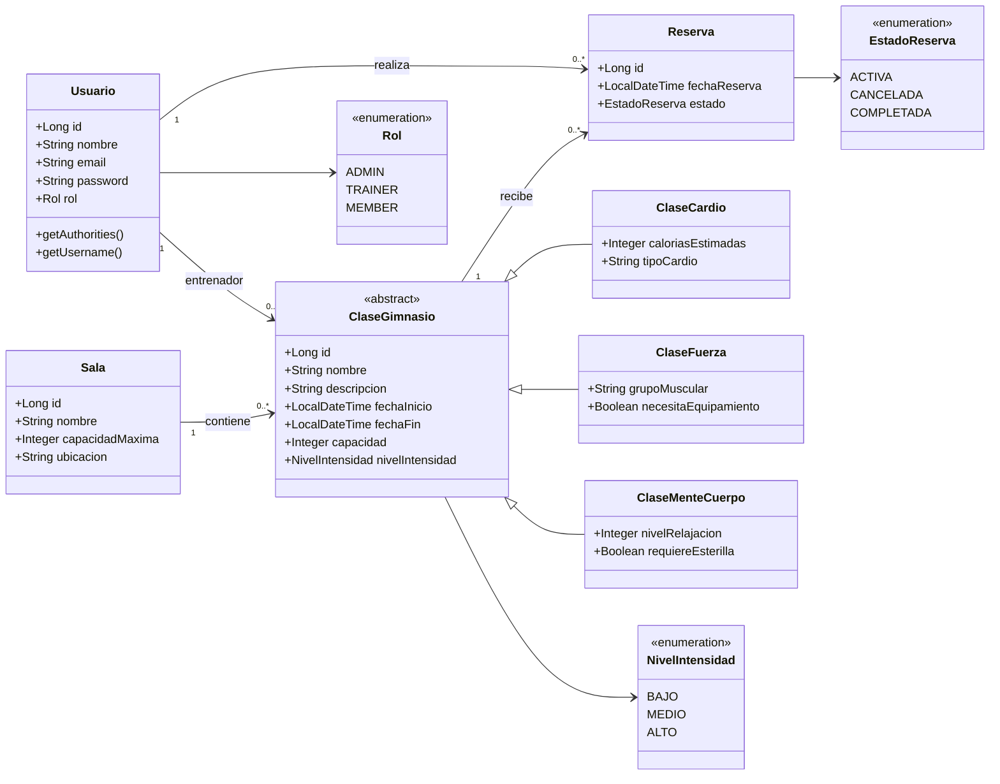
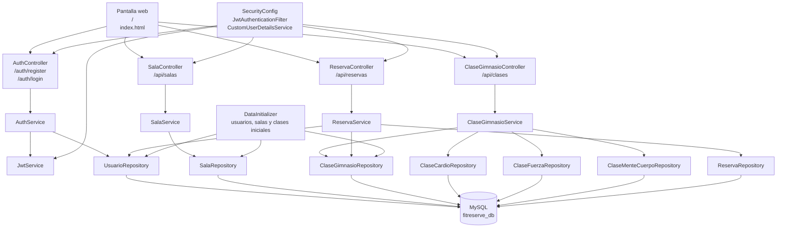
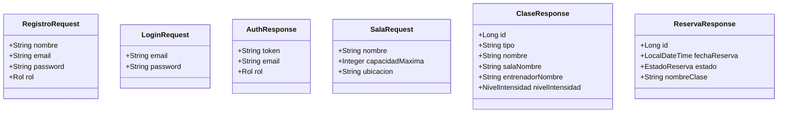
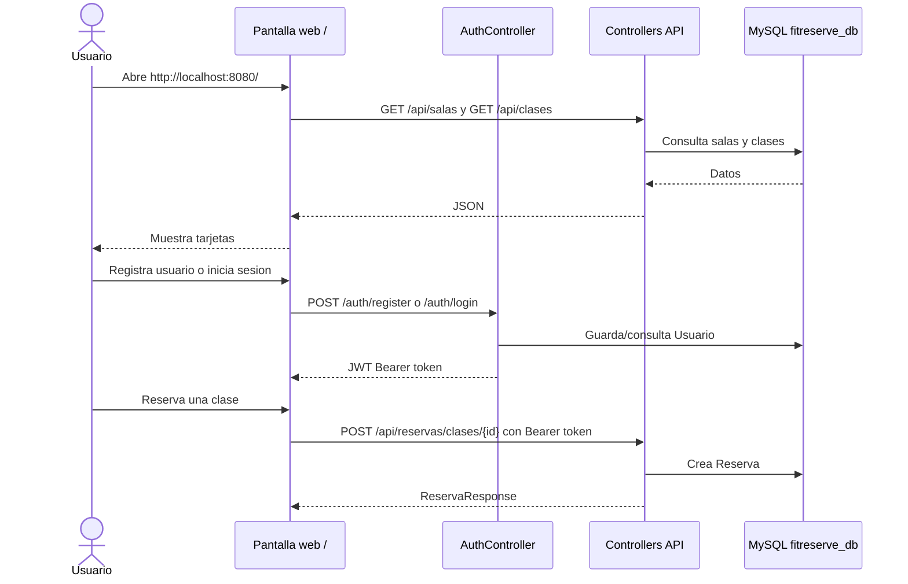

# FitReserve API - Diagrama actualizado

Este documento refleja el estado actual del proyecto FitReserve API: pantalla web en `/`, autenticacion JWT, controllers, services, repositories, entidades JPA, DTOs, MySQL y datos iniciales.

## Diagrama UML de dominio

## Diagrama de arquitectura actual

## DTOs principales

## Flujo de uso visual

## Estado actual verificado

- `GET /` sirve la pantalla visual.
- `GET /api/salas` devuelve salas cargadas.
- `GET /api/clases` devuelve clases cargadas mediante `ClaseResponse`.
- `POST /auth/register` registra usuarios.
- `POST /auth/login` devuelve token JWT.
- `POST /api/reservas/clases/{id}` permite reservar con usuario autenticado.
- `GET /api/reservas/mis-reservas` devuelve reservas mediante `ReservaResponse`.