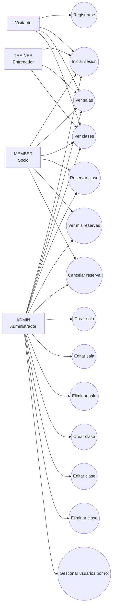

# Diagrama de casos de uso - FitReserve API

Este diagrama resume como interactuan los actores principales con la aplicacion.

## Actores

- Visitante: puede registrarse, iniciar sesion y consultar informacion publica.
- MEMBER: puede reservar clases y gestionar sus reservas.
- TRAINER: representa al entrenador asignado a las clases.
- ADMIN: puede gestionar salas, clases y consultar la informacion completa.

## Casos de uso principales

- Registro e inicio de sesion.
- Consulta de salas y clases.
- Creacion, edicion y eliminacion de salas.
- Creacion, edicion y eliminacion de clases.
- Reserva y cancelacion de clases.
- Autorizacion por roles mediante JWT.
