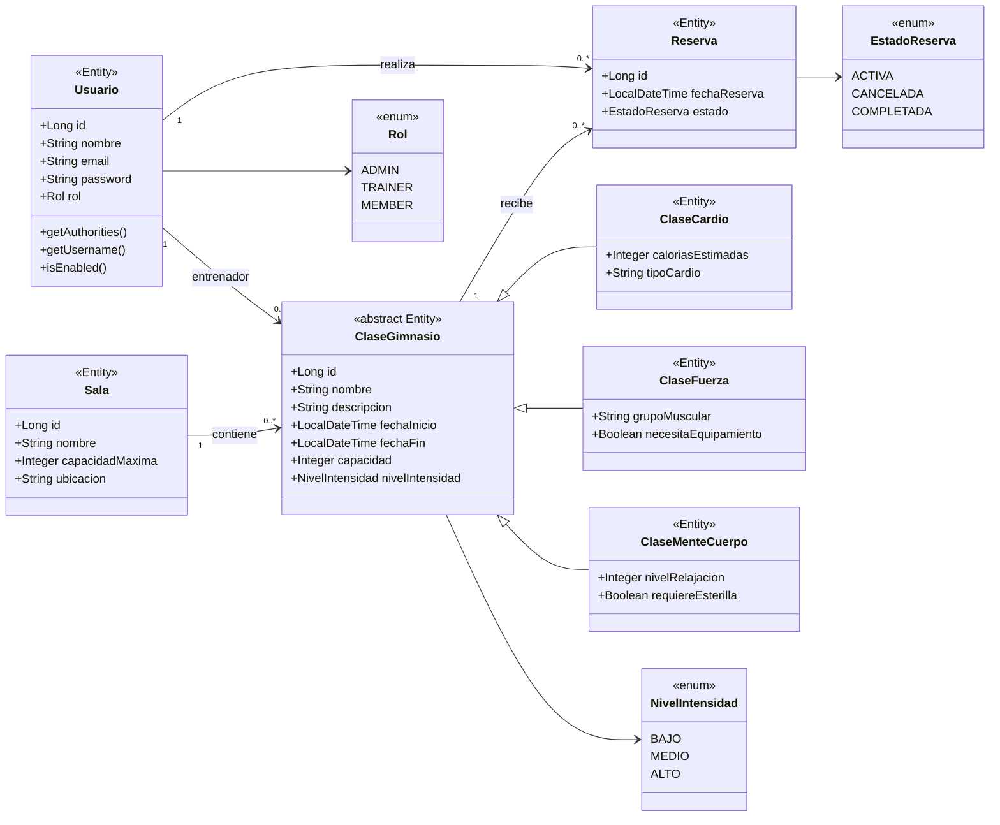
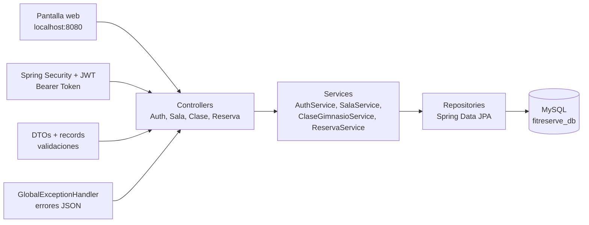

# Diagrama UML actualizado - FitReserve API

Este diagrama representa el proyecto actual de FitReserve API: backend Spring Boot con JPA, MySQL, JWT, usuarios, salas, clases y reservas.

## Notas del modelo actual

- `ClaseGimnasio` es abstracta y usa herencia JPA con `JOINED`.
- `Usuario` implementa `UserDetails` para integrarse con Spring Security.
- Un usuario puede hacer muchas reservas.
- Un usuario con rol de entrenador puede impartir muchas clases.
- Una sala contiene muchas clases.
- Una clase puede tener muchas reservas.
- Las subclases actuales son `ClaseCardio`, `ClaseFuerza` y `ClaseMenteCuerpo`.

## Diagrama de arquitectura actual

