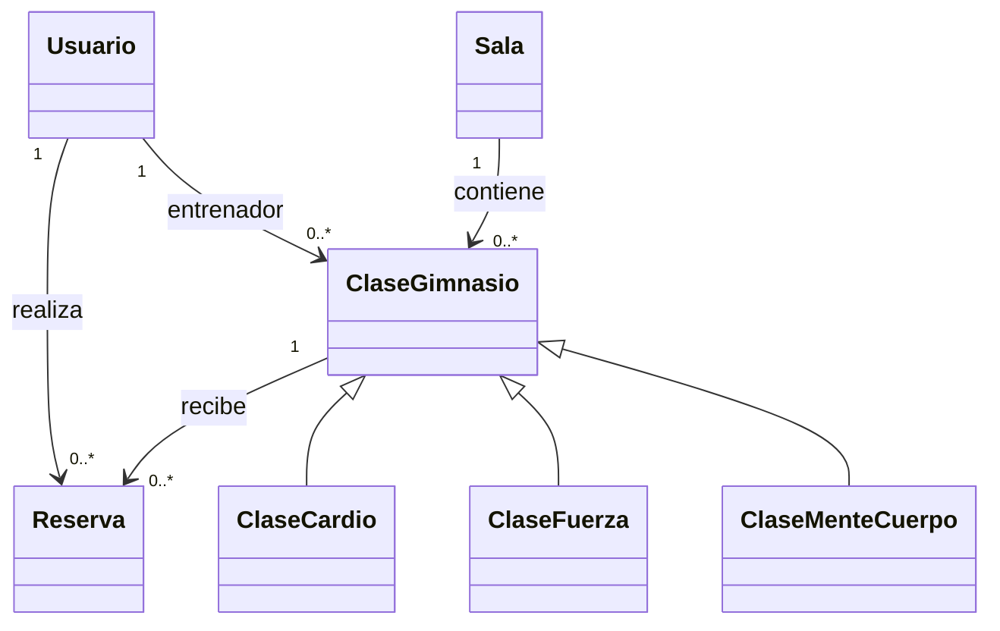

# Presentacion final - FitReserve API

Duracion objetivo: 5 minutos

- 3 minutos de explicacion
- 2 minutos de demostracion
- Total: 10 diapositivas

## Diapositiva 1 - Titulo

**FitReserve API**

Backend de reservas de clases de gimnasio con Spring Boot, MySQL, JPA y JWT.

Juan Garcia

**Notas para hablar:**
Hola, soy Juan Garcia y voy a presentar FitReserve API, una aplicacion backend creada con Java y Spring Boot para gestionar reservas de clases en un gimnasio.

## Diapositiva 2 - Sobre mi

**Sobre mi**

- Me interesa el desarrollo backend.
- Queria practicar una API REST real.
- Elegi un gimnasio porque permite trabajar con usuarios, clases, salas, reservas y seguridad.

**Notas para hablar:**
Para este proyecto queria practicar una aplicacion parecida a un caso real. Un gimnasio me parecia una buena idea porque junta varias partes importantes: base de datos, relaciones, roles, autenticacion y reglas de negocio.

## Diapositiva 3 - Problema

**Reservar clases necesita orden y control**

- Los socios necesitan consultar clases disponibles.
- El gimnasio necesita controlar salas y capacidad.
- Los administradores necesitan gestionar clases y reservas.
- El sistema debe evitar reservas duplicadas y clases llenas.

**Notas para hablar:**
El problema es que una reserva manual puede causar duplicados, sobrepasar la capacidad de una sala o perder informacion. FitReserve centraliza este proceso.

## Diapositiva 4 - Solucion

**FitReserve conecta usuarios, salas, clases y reservas**

- Registro e inicio de sesion.
- Roles: ADMIN, TRAINER y MEMBER.
- CRUD de salas.
- CRUD de clases.
- Reservas y cancelaciones.
- Pantalla web local para probar la API.

**Notas para hablar:**
FitReserve permite registrar usuarios, iniciar sesion, consultar clases, reservar plaza y administrar salas y clases. Tambien tiene una pantalla visual en localhost para hacer pruebas facilmente.

## Diapositiva 5 - Diagrama UML actualizado

**Modelo principal del proyecto actual**

- Usuario realiza reservas.
- Sala contiene clases.
- ClaseGimnasio es abstracta.
- ClaseCardio, ClaseFuerza y ClaseMenteCuerpo heredan de ClaseGimnasio.
- Reserva une Usuario con ClaseGimnasio.

**Diagrama para mostrar:**

**Notas para hablar:**
Este es el modelo actualizado del proyecto. La parte clave es la herencia: ClaseGimnasio es la clase padre y las clases concretas heredan de ella. Use la estrategia JOINED porque cada tipo de clase tiene campos propios.

## Diapositiva 6 - Arquitectura tecnica

**Spring Boot organiza la aplicacion por capas**

- Controllers: reciben las peticiones HTTP.
- DTOs: validan y transportan datos.
- Services: contienen la logica de negocio.
- Repositories: acceden a MySQL con Spring Data JPA.
- Security: gestiona JWT y roles.

**Notas para hablar:**
La aplicacion esta separada por capas. Esto hace que el codigo sea mas limpio: los controladores reciben peticiones, los servicios hacen la logica y los repositorios acceden a la base de datos.

## Diapositiva 7 - Seguridad y roles

**JWT protege las rutas segun el tipo de usuario**

- Las rutas publicas permiten registro, login y consulta.
- ADMIN puede crear, editar y borrar salas y clases.
- MEMBER puede reservar y cancelar sus reservas.
- El token Bearer identifica al usuario en cada peticion.

**Notas para hablar:**
La autenticacion se implementa con JWT. Cuando el usuario inicia sesion recibe un token, y ese token se usa para acceder a las rutas protegidas. Ademas, las rutas estan filtradas por rol.

## Diapositiva 8 - Reto tecnico

**El mayor reto fue combinar JPA, DTOs y seguridad**

- Evitar errores al devolver entidades con relaciones lazy.
- Proteger correctamente rutas por rol.
- Devolver respuestas limpias con DTOs.
- Mantener las reglas de negocio en los servicios.

**Notas para hablar:**
El reto tecnico mas importante fue hacer que JPA y Spring Security funcionaran bien juntos. Para evitar errores de serializacion, use DTOs de respuesta en vez de devolver entidades completas.

## Diapositiva 9 - Error y aprendizaje

**Aprendi a documentar y preparar un proyecto para entrega**

- No subir contrasenas reales a GitHub.
- Dejar `TU_PASSWORD` para que cada persona ponga su contrasena.
- Probar rutas desde navegador y ejemplos HTTP.
- Documentar diagramas, rutas y configuracion.

**Notas para hablar:**
Un aprendizaje importante fue preparar bien la configuracion para GitHub. En vez de subir una contrasena real, el README explica que cada persona debe cambiar TU_PASSWORD por su contrasena local de MySQL.

## Diapositiva 10 - Demo y cierre

**DEMO**

- Aplicacion local: http://localhost:8080/
- GitHub: https://github.com/juangarcia15525/FitReserve
- Diagrama UML: docs/diagrama-uml-nuevo.md

**Gracias**

**Notas para hablar:**
En la demo abriria localhost, mostraria las salas y clases, iniciaria sesion como admin o member y haria una reserva. Gracias por escuchar.
